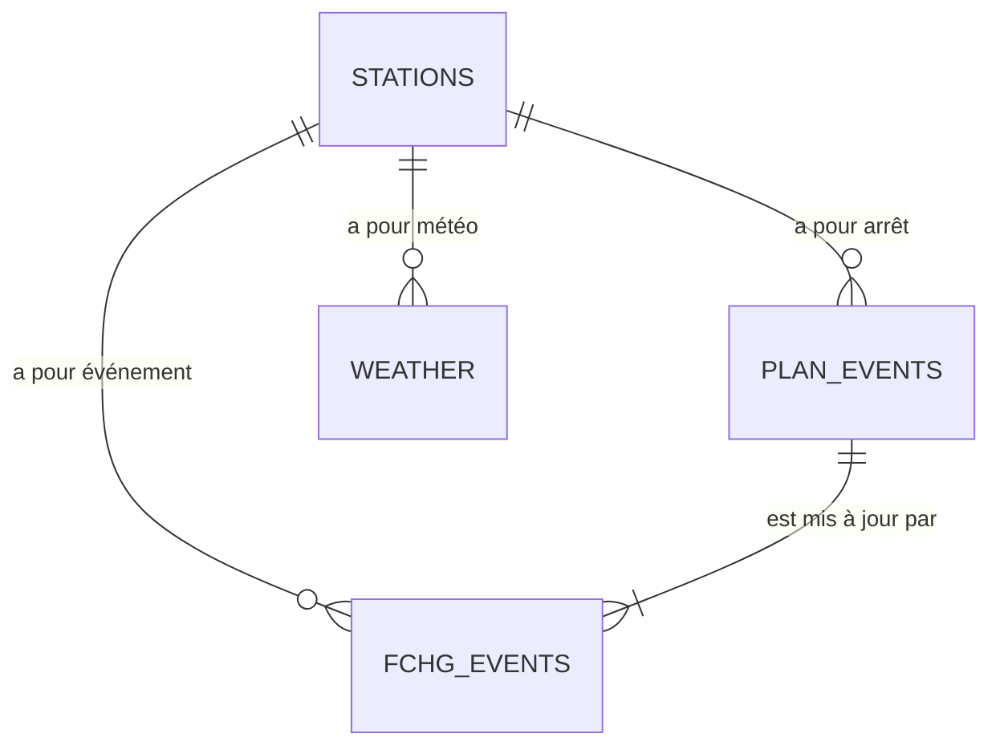

# Analyse Complète & Stratégie Prédictive : Système de Retards (Bremen)

Ce document présente l'analyse technique, fonctionnelle et la feuille de route pour le développement d'un modèle de prédiction de retards (LSTM) centré sur la région de **Bremen**.

## 1. Vue d'Ensemble du Projet

Le système actuel est un pipeline ELT robuste ingérant des données de la **Deutsche Bahn (DB)** et d'**Open-Meteo**.

*   **Périmètre Géographique :** Filtrage strict sur les gares de Bremen et environs (Préfixes `Brem%`, `HB%`).
*   **Architecture :** Airflow (Orchestration) -> PostgreSQL (Stockage Raw/DWH) -> LSTM (Modèle) -> Dashboard (Streamlit).
*   **Volumétrie Actuelle :** ~12.5 Millions d'événements de trafic (FCHG) sur une fenêtre de ~9 mois (Avril 2025 - Janvier 2026).

---

## 2. Analyse du Dataset (DWH)

### 2.1. Les Tables Clés

| Table / Vue | Description | Rôle dans la Prédiction |
| :--- | :--- | :--- |
| **`dwh.timetables_plan_events`** | Horaires théoriques (Planifiés). Une ligne par arrêt (Arrivée/Départ). | **Référence (Baseline).** Sert à calculer l'écart (Retard) et à connaître la séquence théorique des gares. |
| **`dwh.timetables_fchg_events`** | Changements complets (Temps réel). Contient les retards, annulations, changements de quai. | **Cœur du Dataset.** Fournit la variable cible (`delay_in_min`) et les features dynamiques (état du trafic). |
| **`dwh.timetables_rchg_events`** | Changements récents (Delta). | Utile pour analyser la **dynamique d'apparition** d'un retard (soudain vs graduel). |
| **`dwh.v_stations`** | Référentiel des gares (EVA Number, Coordonnées GPS). | **Spatialisation.** Permet de lier les trains à la météo locale et de visualiser les flux sur une carte. |
| **`dwh.v_weather_history_hourly`** | Météo historique par station et par heure. | **Feature Exogène.** Pluie, neige, vent pouvant impacter le réseau. |

### 2.2. Relations et Modèle de Données

*   **Clé de Jointure Principale :** `eva_number` (Identifiant unique de la gare).
*   **Clé de Séquence Train :** `train_line_ride_id` (Identifie un trajet unique d'un train spécifique) + `train_line_station_num` (Ordre des gares).

---

## 3. Dynamique Temporelle & Granularité

L'ingestion des données est conçue pour supporter un apprentissage continu et réactif.

### 3.1. Fréquence d'Ingestion
*   **Plan (Théorique) :** 1 fois par jour (`01:00`). Charge les 30 prochaines heures.
*   **Trafic (Réel - FCHG/RCHG) :** Toutes les **10 minutes**. C'est une fréquence élevée qui permet de capter la "respiration" du réseau quasi en temps réel.
*   **Météo :** Toutes les **6 heures** (Prévisions horaires).

### 3.2. Séquentialité pour le LSTM
Pour le modèle, la notion de temps n'est pas seulement l'heure de la journée, mais la **séquence des gares**.
*   *Exemple :* Train ICE 123
    1.  Bremen Hbf (Retard T=0)
    2.  Bremen-Neustadt (Retard T+1 = ?)
    3.  Delmenhorst (Retard T+2 = ?)

Le modèle doit apprendre que si un retard apparaît à *Bremen Hbf*, il se propage (ou se résorbe) à *Delmenhorst* selon certaines probabilités.

---

## 4. Qualité & Profilage des Données

Analyse réalisée le 2026-01-12 sur la base de production :

*   **Profondeur Historique :** Données disponibles du **11 Avril 2025** au **12 Janvier 2026**. C'est suffisant pour capturer des saisonnalités (vacances, début d'hiver).
*   **Distribution des Retards (`delay_in_min`) :**
    *   **Majorité (74%) :** `NULL` (À interpréter comme "À l'heure" ou "Pas d'info"). *Action : Imputer à 0 pour le ML.*
    *   **Retards fréquents :** Pics observés autour de 40-50 minutes. Cela suggère des incidents majeurs récurrents ou des effets de seuil.
*   **Anomalies Potentielles :**
    *   Présence de retards négatifs ? (Avance). À vérifier.
    *   Valeurs extrêmes (> 120 min) : Sont-elles des annulations déguisées ?

### 4.1. Profil de la View Météo Prévisionnelle
*   **Source :** `dwh.v_weather_forecast_hourly`
*   **Volumétrie :** ~13,776 lignes réparties sur 14 stations clés de Bremen.
*   **Fenêtre Temporelle :** Du 2025-12-09 au 2026-01-18 (Prévisions futures incluses).
*   **Conditions Météo (Top Codes) :**
    1.  **Code 3 (Overcast) :** Dominant (~50%).
    2.  **Code 61 (Rain, slight) :** Fréquent (~11%).
    3.  **Code 2 (Partly cloudy) :** (~9%).
*   **Métriques Physiques :**
    *   **Précipitations :** Moyenne 0.068 mm/h, Max 8.6 mm/h. (17.8% des heures ont de la pluie > 0).
    *   **Vent :** Moyenne 12.77 km/h.

---

## 5. Stratégie de Développement du Modèle LSTM

L'objectif n'est pas de prédire un retard aléatoire, mais de prédire la **séquence temporelle** du retard le long d'une ligne.

### 5.1. Préparation des Features (Feature Engineering)
1.  **Temporelles (Cycliques) :** Heure du jour (Sin/Cos), Jour de la semaine (Sin/Cos), Mois.
2.  **Spatiales :** Coordonnées GPS de la gare (Latitude/Longitude).
3.  **Météo (Join via EVA & Time) :** Précipitations, Vent, Température (Normalisées).
4.  **État du Réseau (Contextuel) :**
    *   Retard cumulé aux 3 gares précédentes.
    *   Type de train (ICE vs RE vs S-Bahn) -> *One-Hot Encoding*.

### 5.2. Architecture LSTM Implémentée

Le modèle est opérationnel et optimisé pour la performance (~52 000 paramètres).

*   **Entrée (Input) :** Une séquence des **5 dernières étapes** du train (Fenêtre glissante).
*   **Architecture (`model.py`) :**
    *   **2 couches LSTM empilées** : Permet de capturer des relations complexes.
    *   **64 neurones cachés (Hidden Units)** : La "capacité de mémoire" du modèle.
    *   **Dropout (0.2)** : Désactive aléatoirement 20% des neurones pendant l'entraînement pour éviter le sur-apprentissage (overfitting).
*   **Sortie (Output) :** Une couche linéaire simple (`Linear`) qui prédit le retard en minutes.
*   **Features (`preprocessor.py`) :** 8 caractéristiques analysées dont le retard actuel, la météo (température, pluie, vent), le contexte temporel (heure, jour) et l'identité du train/gare.

### 5.3. Pipeline d'Entraînement & Orchestration

1.  **Volume :** Entraînement sur **l'intégralité du dataset historique** (plusieurs millions de lignes), sans limite (`limit=None`).
2.  **Orchestration (Airflow) :**
    *   **Training (`train_delay_lstm`) :** Exécution **hebdomadaire**. Ré-entraîne le modèle sur toutes les données disponibles.
    *   **Inférence (`predict_delay_lstm`) :** Exécution toutes les **15 minutes** pour garantir un affichage "Live".
3.  **Split :** Chronologique strict (Train/Val/Test).

---

## 6. Concept de Visualisation "Hors du Commun"

Pour le dashboard final, nous visons une esthétique "Cyberpunk / Control Room" épurée.

### 6.1. Technologies
*   **Frontend :** React + Deck.gl (Uber) ou Mapbox GL JS.
*   **Backend :** FastAPI (servant les prédictions du modèle).

### 6.2. Vues Clés
1.  **The "Pulse" Map (3D Arc Layer) :**
    *   Fond de carte sombre (Dark Mode).
    *   Les lignes de train sont des arcs 3D reliant les gares.
    *   **Couleur dynamique :** Vert (Fluide) -> Rouge (Retard) -> Violet (Annulé).
    *   Animation : Des particules lumineuses parcourent les arcs à la vitesse réelle des trains.

2.  **The "Time Tunnel" (Isochrone) :**
    *   Sélectionner une gare (ex: Bremen Hbf).
    *   Visualiser une "onde" déformée autour de la gare montrant jusqu'où on peut aller en 30 min *compte tenu des retards actuels prédits*.

3.  **Matrice de Corrélation Météo/Retard :**
    *   Graphique interactif montrant l'impact immédiat de la pluie sur la ponctualité moyenne du réseau (Scatter plot animé).

---

## 7. Prochaines Étapes (Roadmap)

1.  ✅ **Data Cleaning (SQL/Pandas) :** Vue `dwh.training_dataset` créée et opérationnelle.
2.  ✅ **Prototypage (ML) :** Modèle LSTM entraîné sur dataset complet et intégré dans Docker.
3.  ✅ **Orchestration (Airflow) :** Pipelines d'entraînement (Hebdo) et d'inférence (15 min) en production.
4.  ✅ **Visualisation (Dashboard) :** Dashboard Streamlit Live déployé avec prédictions temps réel.
5.  ⬜ **Amélioration Continue :** Intégration des incidents textuels (NLP) et affichage des intervalles de confiance.

---

## 8. Dictionnaire des Données & Analyse Détaillée des Attributs (Spécial LSTM)

Cette section détaille chaque attribut du DWH, son origine, sa signification métier, et son utilisation précise dans le modèle LSTM.

### 8.1. Table `dwh.timetables_fchg_events` (Données de Trafic Réel)
*Source principale pour l'apprentissage du comportement des retards.*

| Attribut | Origine (Raw XML) | Signification Métier | Rôle LSTM (Input/Target) | Traitement Requis | Dépendances |
| :--- | :--- | :--- | :--- | :--- | :--- |
| **`delay_in_min`** | `<m c="...">` (Attribut `c` dans le message) | **Le retard actuel en minutes.** Valeur positive = retard, 0 ou NULL = à l'heure. C'est la donnée la plus critique. | **TARGET (Label)** pour la sortie. **FEATURE (Input)** pour les états passés (lags). | **Imputation :** `NULL` -> 0. **Scaling :** RobustScaler (car outliers possibles). | C'est la variable que l'on cherche à prédire à T+1. |
| **`event_time`** | `<ar pt>` / `<dp pt>` ou timestamp message | L'heure **planifiée** de l'événement (arrivée ou départ). Sert de repère temporel absolu. | **FEATURE**. | **Cyclical Encoding :** Extraire Heure (0-23) et Jour (0-6) -> transformation en Sin/Cos pour capturer la cyclicité journalière/hebdomadaire. | Corrélé avec les heures de pointe (Rush Hour). |
| **`eva_number`** | `<timetable eva="...">` | Identifiant unique de la gare (ex: 8000050 pour Bremen Hbf). | **FEATURE** (Identité spatiale). | **Embedding :** Ne pas utiliser tel quel. Utiliser un `Embedding Layer` (dim=10) ou remplacer par Latitude/Longitude. | Lien direct avec `dwh.v_stations`. |
| **`train_type`** | `<tl c="...">` (ex: ICE, RE, S) | Catégorie commerciale du train. Les ICE sont prioritaires mais font de longs trajets; les S-Bahn sont fréquents et locaux. | **FEATURE** (Comportemental). | **One-Hot Encoding :** [Is_ICE, Is_RE, Is_S, ...]. | Influence la probabilité de rattrapage de retard (un ICE peut rouler plus vite pour rattraper). |
| **`is_canceled`** | `<m t="f">` + code | Indicateur d'annulation du train. | **TARGET (Classification)** ou **FEATURE** (État critique). | **Booléen (0/1).** Pour le LSTM principal (Régression Retard), on peut exclure les trains annulés ou les traiter comme retard infini (non recommandé). | Si `is_canceled=1`, `delay` n'a plus de sens. |
| **`train_line_ride_id`** | `<s id="...">` | Identifiant unique du trajet (Trip ID). Permet de relier tous les arrêts d'un même train. | **GROUPING KEY**. | **Non utilisé comme feature.** Sert uniquement à construire les séquences (batches) pour le LSTM. | Essentiel pour le `GROUP BY` lors de la création du dataset. |
| **`train_line_station_num`** | `<ar l="...">` / `<dp l="...">` | Numéro de séquence de l'arrêt sur la ligne. | **FEATURE** (Progression). | **Normalisation :** MinMax (0 à 1) par rapport à la longueur totale de la ligne. | Indique si on est au début (peu de retard accumulé) ou à la fin (retard propagé) du trajet. |
| **`category`** | `<m cat="...">` | Type d'incident (ex: "Verzögerung", "Personen im Gleis"). | **FEATURE** (Explicative). | **NLP / Embedding :** Si utilisé, nécessite un embedding. Souvent trop épars, peut être ignoré dans un premier modèle simple. | Explique la *cause* du retard. |

### 8.2. Table `dwh.timetables_plan_events` (Référence Théorique)
*Utilisée pour connaître la structure "normale" du réseau.*

| Attribut | Origine | Signification Métier | Rôle LSTM | Traitement Requis |
| :--- | :--- | :--- | :--- | :--- |
| **`route_path`** | `<ppth>` | Liste des gares desservies (Plan de route). | **FEATURE** (Contextuelle). | **Complexité :** Difficile à ingérer brut. On peut en extraire "Prochain arrêt majeur" ou "Distance totale". |
| **`platform`** | `<ar/dp pp="...">` | Numéro de quai planifié. | **FEATURE** (Mineure). | **One-Hot Encoding** (Top 10 quais) ou ignoré. | Un changement de quai (dans FCHG) ajoute souvent 2-3 min de retard. |

### 8.3. Vue `dwh.v_stations` (Données Géographiques)
*Apporte la dimension spatiale au modèle.*

| Attribut | Origine | Signification Métier | Rôle LSTM | Traitement Requis |
| :--- | :--- | :--- | :--- | :--- |
| **`latitude` / `longitude`** | API DB (Stations) | Position GPS exacte de la gare. | **FEATURE** (Spatiale). | **Normalisation :** Standardscaler (Centrer sur Bremen). | Permet au modèle d'apprendre des corrélations régionales (ex: retard au Nord-Ouest). |
| **`is_main`** | API DB | Gare principale vs petite halte. | **FEATURE**. | **Booléen.** | Les gares principales ont plus de trafic et potentiellement plus de conflits. |

### 8.4. Vue `dwh.v_weather_forecast_hourly` (Facteurs Exogènes)
*Facteurs externes influençant le réseau.*

| Attribut | Origine (Open-Meteo) | Signification Métier | Rôle LSTM | Traitement Requis | Dépendances |
| :--- | :--- | :--- | :--- | :--- | :--- |
| **`precipitation`** | Open-Meteo | Quantité de pluie/neige (mm). Facteur majeur de ralentissement. | **FEATURE**. | **Scaling :** Log-transform (car distribution très asymétrique) ou MinMax. | Doit être joint à l'événement ferroviaire via `eva_number` (plus proche station) et `event_time`. |
| **`wind_speed_10m`** | Open-Meteo | Vitesse du vent. Risque de chute d'arbres/caténaires. | **FEATURE**. | **Scaling :** Standardscaler. | Fortes corrélations avec les "Grands Incidents" (Sturmschäden). |
| **`temperature_2m`** | Open-Meteo | Température ambiante. | **FEATURE**. | **Scaling :** Standardscaler. | Gel (< 0°C) -> pannes d'aiguillage. Canicule (> 30°C) -> déformation des rails/pannes clim. |
| **`weather_code`** | Open-Meteo (WMO) | Code synthétique du temps (ex: 71 = Chute de neige). | **FEATURE**. | **Embedding** ou One-Hot (Groupement : Pluie, Neige, Clair, Orage). | Meilleur descripteur global que les métriques brutes parfois. |
